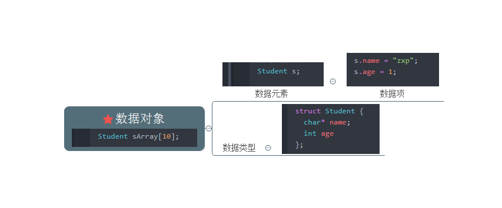
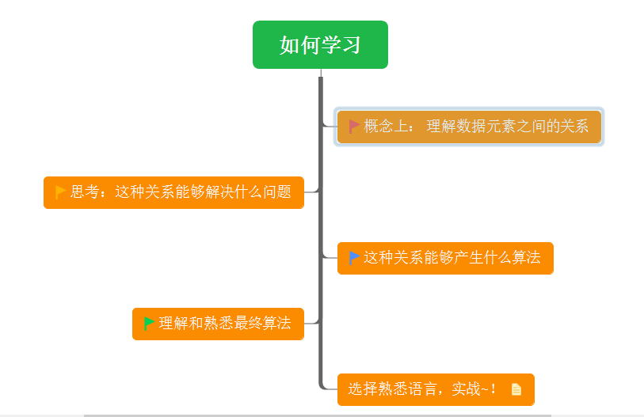

# 数据结构
是对象中数据元素之间的关系
* 数据元素之间不是独立的
  * 存在特定的关系，这些关系即 **结构**
---
## 数据
#### 数据元素
组成数据的基本单位

#### 数据项
一个数据元素由若干数据项组成

#### 数据对象
性质相同的数据元素的集合



```C++
// 数据类型
struct Student {
  char* name;
  int age
};

// 数据元素
Student s;

// 数据对象
Student sArray[10];

//数据项
s.name = "zxp";
s.age = 1;
```

---
## 逻辑结构
#### 集合结构
* 数据元素之间没有特别的关系
* 仅同属相同集合

#### 线性结构
* 数据元素之间是一对一的关系

#### 树形结构
* 数据元素之间存在一对多的层次关系

#### 图形结构
* 数据元素之间是多对多的关系

---
## 物理结构
逻辑结构在计算机中存储的形式

#### 顺序存储结构
* 数据存储在地址连续的存储单元里

#### 链式存储结构
* 将数据存储在任意的存储单元里
* 通过保存地址的方式找到相关联的数据元素

---
## 如何学习

* 1. 概念上 ： 理解数据元素之间的关系
* 2. 思考这种关系能够解决什么问题
* 3. 这种关系能够产生那些算法
* 4. 理解和熟悉最终算法
* 5. 选择熟悉的语言，编程实战
