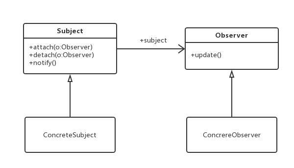

# 观察者
---
## 从开始的uml-class图看观察者


从图上看：
我们为了让 ConcreteSubject 对象 和 ConcreObserver 有联系，我们给他们上层套了一层关系。
可能会有不同的 ConcreObserver对象， 这是个一对多的关系

## observer作用
* 作用或者说目的， 就是 能够解决当 一个对象状态发生改变的时候，这个改变能告诉其他对象
* 而在uml的class图上的感官就是 ： subject对象的一个函数能够遍历 这些Observer的一个函数
* observer类的固定，一旦接口update固定下来，剩下的observer就只能这样实现

## observer实现
但是C++并不是完全的面向对象，面向对象只是其中一部分
* 如果只是为了实现 一个对象状态改变，这个对象状态能够通知到其他对象上，
  * 直接按照类图也能实现
  * 从基本的函数关联来说，函数指针，这个是一个选择，在C语言的国度里，遍地都是函数指针


直接从本质出发，这个观察者模式不过是一个对象的notify函数，可以call 其他对象的call，只不过我们需要管理

### 实现 1
摘自大话设计模式
```C++
class IObserverBase;
class ISubject
{
public:
     virtual void Attach(IObserverBase* observer) = 0;
     virtual void Detach(IObserverBase* observer) = 0;
     virtual void Notify() = 0;

     virtual string& GetAction() = 0;
     virtual void SetAction(string& ) = 0;
};

class Secretary : public ISubject
{
public:
    Secretary() {}

    virtual void Attach(IObserverBase* observer);
    virtual void Detach(IObserverBase* observer);
    virtual void Notify();
public:
    virtual string& GetAction() {return action;}
    virtual void SetAction(string& action){this->action = action;}
private:
    list<IObserverBase*> lstObservers;
    string action;
};

class Boss : public ISubject
{
public:
    Boss() {}
    virtual void Attach(IObserverBase* observer);
    virtual void Detach(IObserverBase* observer);
    virtual void Notify();
    virtual string& GetAction(){return action;}
    virtual void SetAction(string& act){ this->action = act;}

private:
    vector<IObserverBase* > vctObservers;
    string action;
};
//////////////////////////////////////////////////////////////////////////

class IObserverBase
{
public:
    IObserverBase(string name, ISubject* Sec){
        this->name = name;
        this->Sub = Sec;
    }
    string& GetName(){ return name;}
    virtual void Update() = 0;
protected:
    string name;
    ISubject* Sub;
};


class StockObserver : public IObserverBase
{
public:
    StockObserver(string name, ISubject* sub) : IObserverBase(name, sub){  }

    virtual void Update()  {
        cout << "股票关闭" << endl;
    }
};

class NBAObserver : public IObserverBase
{
public:
    NBAObserver(string name, ISubject* sub) : IObserverBase(name, sub)  {    }

    virtual void Update()    {
        cout << "NBA关闭" << " : " << Sub->GetAction() << endl;
    }
};
```

### 实现2
严格的按照面向对象实现也是可以的,但是有时候记住目的的话，就没必要实现类似于接口一类的东东
```C++
class simpSubject {
	using NotifyType = void();
public:
	simpSubject() {}
	~simpSubject(){}

public:
	void connect(std::function<NotifyType>& fun) {
		m_map.push_back(fun);
	}

	void notify() {
		for (auto& it : m_map){
			it();
		}
	}
private:
	std::list<std::function<NotifyType> > m_map;
};

struct otherOberver {
	void Notify() { std::cout << "otherOberver invoked" << std::endl; }
};
```

### 实现 3
上面是简单利用了 bind 和 function 这两个模板， 直到有一次我看到了C++11深入应用里面的实现，感觉那个实现可以让别人直接使用
```C++
class NonCopyable{
protected:
	NonCopyable() = default;
	~NonCopyable() = default;

	NonCopyable(const NonCopyable&) = delete;
	NonCopyable& operator = (const NonCopyable&) = delete;
};

template<typename Func>
class Events : public NonCopyable{
public:
	Events() {}
	~Events() {}

	// 注册观察者
	int Connect(Func& f) {
		return Assign(f);
	}

	int Connect(Func&& f) {
		return Assign(f);
	}

	//移除观察者
	void Disconnect(int key) {
		m_mapConnection.erase(key);
	}

	// 通知所有观察者
	template<typename...Args>
	void Notify(Args&&...args) {
		for (auto& it : m_mapConnection)
		{
			it.second(std::forward<Args>(args)...);
		}
	}

private:
	template<typename F>
	int Assign(F&& f) {
		int k = m_nObserverID++;
		m_mapConnection.emplace(k, std::forward<F>(f));
		return k;
	}

private:
	int m_nObserverID = 0;	//观察者编号
	std::map<int, Func> m_mapConnection;
};
```
上面由于 function 对象没有其他的对比，所以就单独给他们弄了一个id

使用了模板之后，需要定义 函数类型， 不过这样的话，使用方式需要改变一下，原来使用的观察者模式需要继承。
现在的话，就是组合， 至少observer那边不需要继承了。
