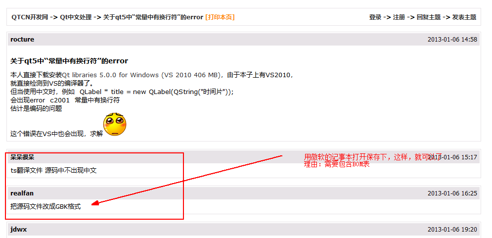
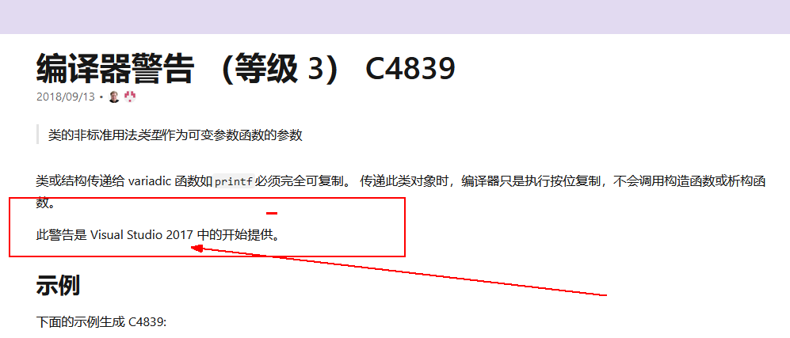

# Header
## 修改头文件出现的bug
#### 出现的现象
调试的时候，发现头文件中定义的结构体，依然是原有结构体

#### 原因
整体编译的时候(并未重新整体编译)，编译器有时候会略过新的头文件。

#### 解决方法
这种问题出现之后的解决方案的思想：大致都是想方法让编译器知道这个是最新的需要重新编译  
目前我实行的方法：
* 方法一：整体重新编译
  * 这样做原因：原有编译时候生成的中间文件会全部删除，然后重新生成，然后链接
  * 缺点：太耗时间(之前编译产生的汇编文件，需要重新生成)


* 方法二：首先单独编译修改的头文件，然后整体编译(非全部重新编译)
  * 这样做的原因：重新生成的中间文件，该文件的时间戳是最新的,  
    这样编译器整体编译的时候会重新编译包含该头文件的文件，然后再链接
  * 目前还没有遇到这样修改之后的问题。
---
# windows 下编译
使用cmd重定向， 把compile 信息 重定向到一个文件中
compile.bat > Info.txt


## windows 属性表

## 对于一个界面对象
#### 需要添加必须的接口
* 开始的时候 Init();
* 关闭的时候 UnInit();


## Qt删除多线程对象
* 一定要使用 `deleteLater()`

---
## 对于一个接口
### 涉及到处理数据 的 格式
* 1.异常处理
* 2.处理数据

---
### 涉及到 有初始值的 数据处理 的格式
* 1.初始化
* 2.处理

### Link 1104
#### 将要生成的dll爆出1104
* 原因：进程中还留有dll
* 解决：杀死带有当前dll的进程

## C2001: 常量中有换行符
* 涉及到文档的编码问题
  * 非英文字符 在windows环境下 需要使用带有BOM表的文档

* 简单解决方法：
  * 使用微软的记事本保存下

* 截图：

---
## 对于不能及时销毁的数据，存储方法：
#### 单独存储
* 与界面无关
* 所有界面的操作类似于 view/model 展示逻辑
* 这样做的好处：
  * 数据界面分离
  * 数据可以有多种展示

#### 与界面绑定存储
* 在界面对象中
* 如果需要保证 界面关闭后 数据依然存在 的两种直接简单的方法
  * 数据本身使用堆内存
  * 界面对象使用堆
* 这样做的好处:
  * 所见即所得


---
## 调试平台相关数据
#### 1. 对比两个平台之间是否有数据迥异的问题

#### 2. 抓包：抓取是否本机获取异常

#### 3. 查找本机获取数据代码，以及处理数据代码

#### 通常情况：3 --> 1 --> 2
#### 也可以 ： 2 --> 3

---
## 调试dump文件
#### 调试准备的必要文件
* 1. 当前的dump
* 2. 以及与dump **相同版本** 的符号表(pdb)
* 3. 代码最好

---
## 升级包保存的逻辑问题：
###问题描述
* 升级之后依然是默认的，而不是用户本身保存的

### 原因
* 配置文件中缺省的配置，程序有相应默认配置
* 当用户进行保存自己的配置时，如果该配置与默认配置相同，则不保存在用户的配置文件中
* 这时，当升级之后配置文件没有该配置，升级之后的程序只能读取自己的默认配置，此时出现了 结果不同的 bug

### 解决方案
* 添加 首次保存的flag
* 当系统运行时，首次不管结果如何，进行保存。
* 第二次时，则可以继续比较

```C++
bool bSaved = false;

if(!bSaved)
{
  //Save some
}

bSave = true;

```

---
## 库版本问题
### 问题描述
* 库版本不对

### 检测
* 确认正确的流
* 利用正确的流的库替换错误的流 确认
---
## 打开Beyond Compare 4，提示已经超出30天试用期限制，解决方法：

修改C:\Program Files\Beyond Compare 4\BCUnrar.dll,这个文件重命名或者直接删除，则会新增30天试用期，再次打开提示还有28天试用期
一劳永逸，修改注册表
*    1)在搜索栏中输入 regedit  ，打开注册表
*    2) 删除项目：计算机\HKEY_CURRENT_USER\Software\ScooterSoftware\Beyond Compare 4\CacheId
---
## wireshark抓包
ip.addr  
http  
xml  
contains  "(string)"
<cusdk:GetUserDevByGroup>
<cusdk:SearchDevice>

---
# 导出 excel 与 导出 csv 的问题

## 问题：excel 与 CSV 单元格内的 换行
## 解决：
#### excel的解决：
* 设置cellformat的属性： **WrapText** 为真
* `https://docs.microsoft.com/zh-cn/office/vba/api/excel.cellformat.wraptext`
#### csv的解决
* 设置将值 用双引号包裹住

## 注意的问题：
#### 1. 需要分清 字符串的 "\n" 还是 字符 '\n'
* 当为字符串时，我们用excel打开之后会看到 不会换行， 而字符'\n'会换行

#### 2. 触发换行的问题
* 在windows中 导出excel的表格中 字符'\r\n' 和 '\n'都会触发换行
* csv中 '\r\n'相当于两次换行了
* 考虑兼容性的话：目前可以尽量使用 字符 '\n'

---
# vs 工程文件出现错误
## 问题：vs2010下 debug编译没有问题，release出现错误
## 解决：
* 查找工程文件中的出错的.cpp
* 删除当前.cpp

---
## 2019完美解决TeamViewer检测商用问题

链接: https://pan.baidu.com/s/1ZXZn8W9y-7LuNfzkZ2ULnA 提取码: 26yu

下载之后解压需要密码，文件名已包含密码。

建议使用tv14版本，tv13版本好像用不了。

---
# 图标的问题
## 问题： 图标显示不出来
## 解决： 图标大小有问题时，可以制作多个尺寸合一的ico

---
```C++
int getKeysCount(QString& path)
{
    QSettings errCodeIni( path, QSettings::IniFormat );
    errCodeIni.setIniCodec( "UTF-8" );
    errCodeIni.beginGroup( "ERROR" );

    int nCount = errCodeIni.allKeys().count();
    return nCount;
}

void setErrorCode(int nBegin, QString& path)
{
    QSettings errCodeIni( path, QSettings::IniFormat );
    errCodeIni.setIniCodec( "UTF-8" );
    errCodeIni.beginGroup( "ERROR" );
    QStringList allErrorCodes = errCodeIni.allKeys();

    int nEnd =  (nBegin + 1)* 50 < allErrorCodes.size() ? (nBegin + 1)* 50 : allErrorCodes.size();

    for (int i = nBegin * 50; i < nEnd; ++i)
    {
        int er = allErrorCodes[i].toInt();
        QString errDesc = errCodeIni.value( allErrorCodes[i], allErrorCodes[i] ).toString();
        if (errDesc.isEmpty())
        {
            int i;
            i = 99 ;
        }
     //   assert( !errDesc.isEmpty() );
        g_mapCode2Desc[ er ] = errDesc;
    }


    //for( int i=nBegin; i< allErrorCodes.size() && nEnd; ++i )
    //{
    //    SetErrorCode(allErrorCodes, i, errCodeIni);


    //    QString des = g_mapCode2Desc[ er ];
    //    des;
    //}
}
```

## 查询日志
#### 查找具体的窗口
1. 通过打印窗口信息 拿到 devID 和 chnID
2. 在CU日志里搜索 DevID 找到调用 cmd， 通过 chnID 确认playerID 以及 vsid
3. 通过player 找到 hMonitorWnd

---
## auto 的 问题
#### 现象：
利用 auto 获取的 vector 和原有的 vector是不同的对象
```C++
// 此处 SubRecords 返回的是引用
auto vctSrcSub = RecSrc.SubRecords();
//这里相当于 新建了一个对象 vctSrcSub  并使用 上述引用初始化
```

#### 解决：
```C++
CRecordTimeRangeList& vctSrcSub = RecSrc.SubRecords();
auto& vctSrcSub = RecSrc.SubRecords();
```

#### 原因：
auto 的知识 不牢固

---
## 数据处理
一种是传递当前消息 和 设备信息给线程，让线程通过消息识别处理流程，通过设备信息 关联 具体的某个设备。这种处理方法在线程类中实现。这种做法容易将设备结构体单纯地视为数据传来传去。

---
## >cl : 命令行 error D8016: “/ZI”和“/Gy-”命令行选项不兼容
#### 场景：
vs2013编译的 海康的demo，转换成 vs2017编译之后，直接就爆出来这个错误

---
## decodecardsdk.h(151): error C3690: 应该为字符串文本，但找到的是用户定义的字符串文本
#### 场景：
vs2013编译的 海康的demo，转换成 vs2017编译之后，直接就爆出来这个错误

#### 原因：
```C++
#define DLLEXPORT_API  extern "C"__declspec(dllexport)
```
 这里之前缺了一个空格

#### 解决：
添加空格
```C++
#define DLLEXPORT_API  extern "C"  __declspec(dllexport)
```

---
## error C4839: 将类 "CFileException" 作为可变参数函数的参数的非标准用法
#### 场景：
vs2013编译的 海康的demo，转换成 vs2017编译之后，直接就爆出来这个错误
```C++
```

#### 原因：



---
## error C2440: “初始化”: 无法从“const char [4]”转换为“char *

#### 原因
在 C 中，字符串文字的类型是数组char，但在C++，它是数组const char

---
## 海康绝对时间跳转异常
2020-7-30 15:02:09
### 场景
系统时间转换成海康的时间结构体，设置进 跳转 之后， 跳转异常

### 原因：  
#### 中间转换过程：
* 海康结构体 ->  tm
* tm -> time_t
* time_t 加减(以秒 为单位 进行跳转)
* time_t -> tm
* tm -> 海康结构体

#### 结构体分析
* 海康结构体中， 年月日都是当前的年月日
  * 即 2020年 在 海康结构体中就是 2020
* tm 结构体： tm的结构体 是 从 1900年开始 月份 从 0开始
  * 2020年 在 tm结构体中 ： 2020 - 1900 = 120
  * 10月份 在 tm 结构体中： 10 - 1 = 9

#### 转换
* 海康结构体 向 tm 转换时： 年 要（-1900） 月 要(-1)
* tm 向 time_t 转换时：使用 mktime()  
  * mktime 函数意义 就是 能够转换成本地时间(本地 这点很重要)
* time_t 向 tm 转换时： 使用 gmtime() **这里出错了**
  * 系统还有个 localtime, 这个才是转换成本地时间的


#### 总结
对于相互的转换，当有正的运算时，应及时定义出 相应的逆运算， 这种最好做成一个简单的工具
