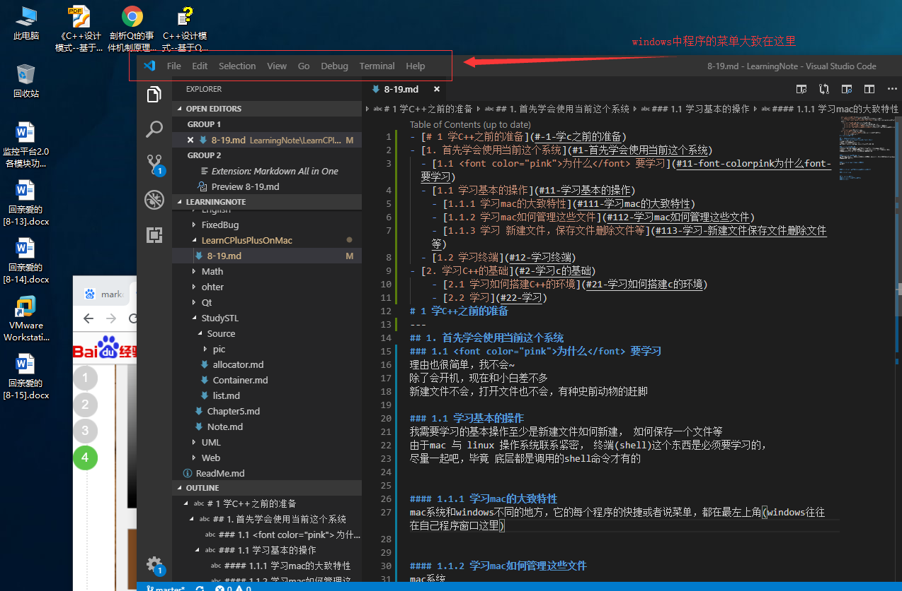
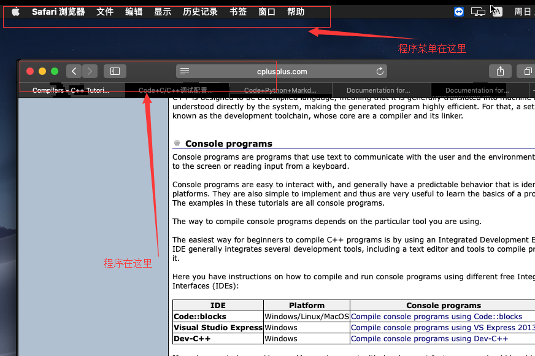
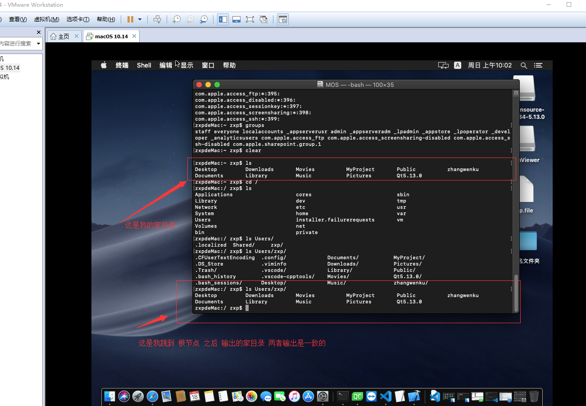

- [# 1 学C++之前的准备](#-1-学c之前的准备)
- [1. 首先学会使用当前这个系统](#1-首先学会使用当前这个系统)
  - [1.1 为什么 要学习](#11-font-colorpink为什么font-要学习)
  - [1.1 学习基本的操作](#11-学习基本的操作)
    - [1.1.1 学习mac的大致特性](#111-学习mac的大致特性)
    - [1.1.2 学习mac如何管理这些文件](#112-学习mac如何管理这些文件)
    - [1.1.3 学习 新建文件，保存文件删除文件等](#113-学习-新建文件保存文件删除文件等)
  - [1.2 学习终端](#12-学习终端)
- [这里的学习 等到 她进度怎么样，以及定好的学习计划所占用的学习时间是多少 然后一起学习吧。（虽然大致原理差不多，还是要加装不会陪她学习一波~）](#这里的学习-等到-她进度怎么样以及定好的学习计划所占用的学习时间是多少-然后一起学习吧虽然大致原理差不多还是要加装不会陪她学习一波)
- [2. 学习C++的基础](#2-学习c的基础)
    - [2.1 学习如何搭建C++的环境](#21-学习如何搭建c的环境)
    - [2.2 学习C++的大致编译步骤](#22-学习c的大致编译步骤)
    - [2.3 学习基础的语法(与 C语言 重合的部分)](#23-学习基础的语法与-c语言-重合的部分)
    - [2.4 继续返回到编译步骤，稍微再深一点？](#24-继续返回到编译步骤稍微再深一点)
    - [2.5 学习面向对象](#25-学习面向对象)
# 1 学C++之前的准备
---
## 1. 首先学会使用当前这个系统
### 1.1 为什么 要学习
理由也很简单，我不会~  
除了会开机，现在和小白差不多
新建文件不会，打开文件也不会，有种史前动物的赶脚

### 1.1 学习基本的操作
我需要学习的基本操作至少是新建文件如何新建， 如何保存一个文件等  
由于mac 与 linux 操作系统联系紧密， 终端(shell)这个东西是必须要学习的，  
尽量一起吧，毕竟 底层都是调用的shell命令才有的

#### 1.1.1 学习mac的大致特性
* mac系统和windows不同的地方，它的每个程序的快捷或者说菜单，都在最左上角(windows往往在自己程序窗口这里)
    * windows的：
    
    * mac的：
    

#### 1.1.2 学习mac如何管理这些文件
mac系统的文件系统实际上很像linux(这里就是linux)， 看起来就是一棵树 不断地发散
* 树根就是 "/"
* 根下面有各种文件夹(又叫文件目录)
* 自己用户的文件夹是在User里面

#### 1.1.3 学习 新建文件，保存文件删除文件等
这里保存文件和新建文件什么的，在mac里面有两种方式
* 1.用终端保存
  * 终端的保存，这里需要在学习终端的时候讲
* 2.用程序保存
  * 相应的程序创建相应的文件，修改相应的文件
  * 我用了 vscode 右击就能新建保存文件
### 1.2 学习终端
这里的学习 等到 她进度怎么样，以及定好的学习计划所占用的学习时间是多少 然后一起学习吧。（虽然大致原理差不多，还是要加装不会陪她学习一波~）
---
## 2. 学习C++的基础
这里应该在上面差不多学会了使用电脑的情况下再开始学习，毕竟，这里需要用到命令行(就是终端)，不过前期可以一点一点带着敲出来，(毕竟初期的学习就是抄别人的，看看结果，最好也能和别人一样输出出来~)

#### 2.1 学习如何搭建C++的环境
这里需要搭建两个环境
* 1.xcode
* 2.Qt 

实际上这两个下载安装一直下一步就行了，只是还是要自己亲手弄一下，万一出现了问题，尝试询问解决

#### 2.2 学习C++的大致编译步骤
这里可以结合命令能看出来，只是大致学会简单的编译
* g++ 这个编译命令能熟练使用
* 知道自己写的代码最后转换的程序在哪里
  
#### 2.3 学习基础的语法(与 C语言 重合的部分)
这一部分东西稍微多一点，不过 这时候一点一点学习吧，大致分为：
* 类型
* 操作符
* 条件控制
* 循环控制
* 指针(这个很重要~)
* 函数?
* 简单的文件如何组成一个小程序？
* 简单的数据结构？

#### 2.4 继续返回到编译步骤，稍微再深一点？
* 这里需要练习稍微简单的分部编译的步骤
* 预处理
* 编译
* 汇编
* 链接
  

#### 2.5 学习面向对象
上面估计目测要一年了？ 这里如果她进展快了，应该会很快吧？毕竟面向对象python原生支持的。  
到时候就给她稍微讲解面向对象的思想？