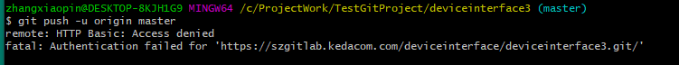
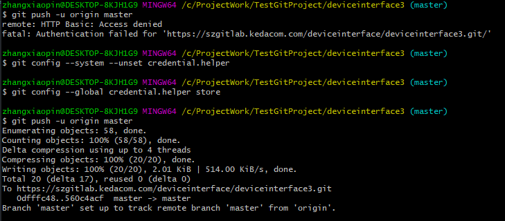

# 一些Git上使用时出现的问题：
---
## push时候出现问题
#### 具体描述
push的时候出现失败


#### 解决方法
执行：
```shell
git config --system --unset credential.helper
```
* 上述命令如果失败： 可能是文件夹权限不够，放开权限就可以

再执行：
```shell
git config --global credential.helper store
```

然后重新登录一遍就好了

