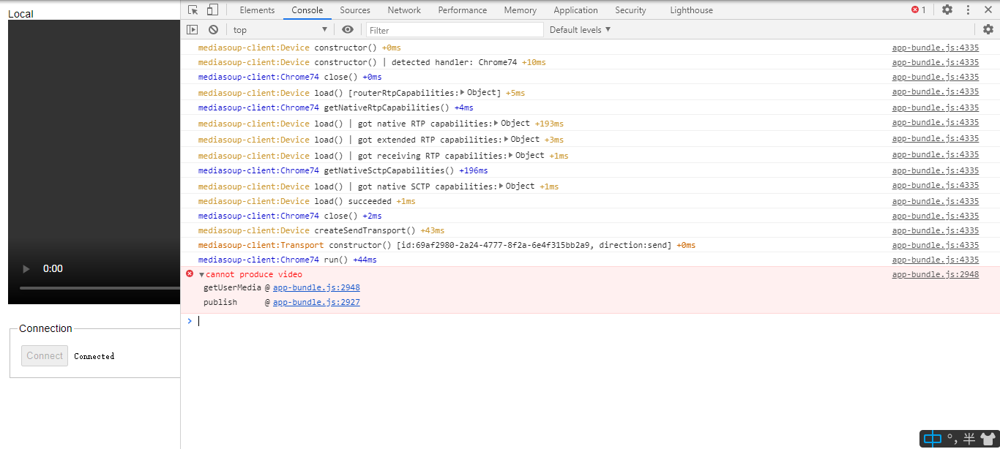

# 9-12
---
## task: 测试同时打开多个
#### 查看 webrtc
chrome://webrtc-internals/

```
任务： 测试 chrome 打开多个效果
记录： 
    真实的chrome： 
        两个浏览器实例：能够打开页面，但是多个浏览器 并未出现多个视频窗口
        单个浏览器实例，两个page： 能够打开页面，并未出现多个视频窗口
    
    puppeteer自带浏览器： 
        单个浏览器实例： 打开之后并未出图。 

```
